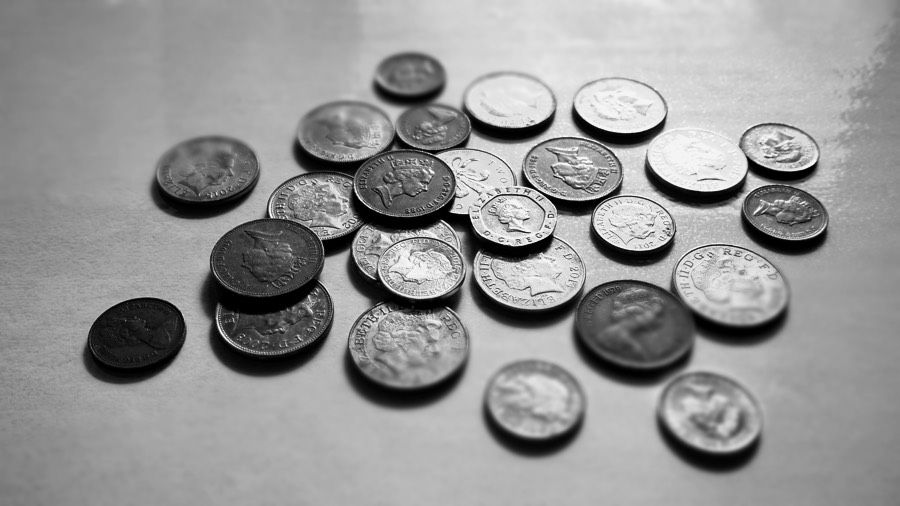

Starling CoinJar
======

A simple webservice that implements a Coin Jar for your [Starling Bank](https://starlingbank.co.uk) account.

This service watches your [Starling Bank](https://starlingbank.co.uk) transaction log for the things you spend. For any transaction it sees it rounds up the amount to the nearest pound (£) and puts it in a virtual coin jar savings goal - much like you would do with the change in your pocket at the end of the day.

## Getting Started

>TLDR. Create Starling Developer account and retrieve personal access tokens. Start up this service at an accessible url/domain with those tokens. Point a new webhook in your Starling Developer account at that same url/domain. It creates a Goal for you and starts working. 